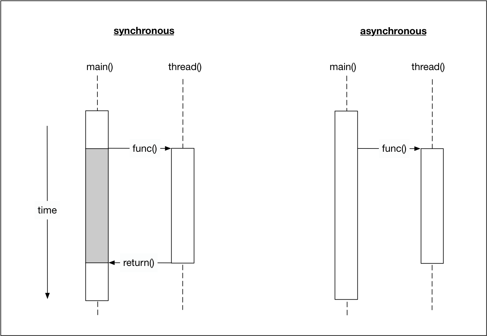
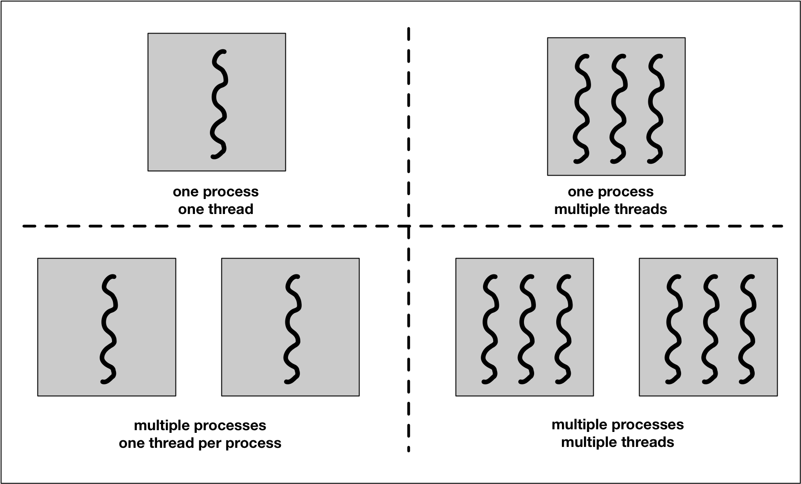

# Project 4: Concurrency 

Topics covered:

- __Lesson 1__: Difference between Processes and Threads
  - write first concurrent program
  - Detailed introduction to the Concurrent Traffic Simulation project
- __Lesson 2__: Sharing data between threads
  - C++ _Promises_ and _Futures_
  - Difference between threads and tasks
  - Strategies to avoid _data races_ - a major source of errors in concurrent programming
- __Lesson 3__: Safely share data between threads (without creating data races)
  - C++ _mutexes and locks_ - among the most important concepts of the C++ Nanaodegree course
- __Lesson 4__: _Condition variables_ - expanding on mutexes and locks
  - Develop a mechanism for safe concurrent data exchange between threads using a _message queue concept_
- __Project__: Concurrent Traffic Simulation
  - Use concurrency to add traffic lights to the simulation
  - Each vehicale in the simulation will run in its own thread

## Lesson 1.2: Processes and Threads

Notes from Lesson 1.2 video:

- __Processes__:
  - Inter-process communication channels: _signals, sockets, files_, etc.
  - _"Easier to write safe concurrent programs using processes instead of threads."_- Why? OS handles much of the overhead for and safeguarding between processes for us!
  - A lof of overhead - time and resources - required to start a process (as compared to starting multiple threads).
  - Can run multiple threads in a single process!

- __Threads__:
  - Threads often referred to as _lightweight processes_.
  - the multiple threads of a single process share the same _address space_ - meaning that _most_ of the data can be accessed by all of the threads.
  - Overhead associated with using multiple threads is much smaller than with using multiple processes; however, this comes at a price - it is up the the programmer to ensure that the _view_ of the data that can be _seen_ by each thread is consistent.

In contrast to synchronous programs, the main program can continue with its line of execution without the need to wait for the parallel task to complete. The following figure illustrates this difference.

A _process_ (also called a _task_) is a computer program at runtime. It is comprised of the runtime environment provided by the operating system (OS), as well as of the embedded binary code of the program during execution. A process is controlled by the OS through certain actions with which it sets the process into one of several carefully defined states:

- __Ready__: After its creation, a process enters the ready state and is loaded into main memory. The process now is ready to run and is waiting for CPU time to be executed. Processes that are ready for execution by the CPU are stored in a queue managed by the OS.
- __Running__: The operating system has selected the process for execution and the instructions within the process are executed on one or more of the available CPU cores.
- __Terminated__: When a process completes its execution or when it is being explicitly killed, it changes to the _terminated"_ state. The underlying program is no longer executing, but the process remains in the process table as a "zombie process". When it is finally removed from the process table, its lifetime ends.
- __Ready Suspended__: A process that was initially in ready state but has been swapped out of main memory and placed onto external storage is said to be in suspend ready state. The process will transition back to ready state whenever it is moved to main memory again.

- __Blocked Suspended:__: A process that is blocked may also be swapped out of main memory. It may be swapped back in again under the same conditions as a "ready suspended" process. In such a case, the process will move to the blocked state, and may still be waiting for a resource to become available.

Processes are managed by the _scheduler_ of the OS. The scheduler can either let a process run until it ends or blocks (_non-interrupting scheduler_), or it can ensure that the currently running process is interrupted after a short period of time. The scheduler can switch back and forth between different active processes (_interrupting scheduler_), alternately assigning them CPU time. The latter is the typical scheduling strategy of any modern operating system.

Since the administration of processes is computationally taxing, operating systems support a more resource-friendly way of realizing concurrent operations: the __threads__.

A _thread_ represents a concurrent execution unit within a process. In contrast to full-blown processes as described above, threads are characterized as light-weight processes (LWP). These are significantly easier to create and destroy: In many systems the creation of a thread is _up to 100 times faster_ than the creation of a process. This is especially advantageous in situations, when the need for concurrent operations changes dynamically.

Threads exist within processes and share their resources. As illustrated by the figure above, a process can contain several threads or - if no parallel processing is provided for in the program flow - only a single thread.

A major difference between a process and a thread is that __each process has its own address space__, while a thread does not require a new address space to be created. __All the threads in a process can access its shared memory__. Threads also share other OS dependent resources such as processors, files, and network connections. As a result, the management overhead for threads is typically less than for processes. __Threads, however, are not protected against each other and must carefully synchronize when accessing the shared process resources to avoid conflicts (_data races_)__.

Similar to processes, threads exist in different states, which are illustrated in the figure below:

- __New__: A thread is in this state once it has been created. Until it is actually running, it will not take any CPU resources.
- __Runnable__: In this state, a thread might actually be running or it might be ready to run at any instant of time. It is the responsibility of the __thread scheduler__ to assign CPU time to the thread.
- __Blocked__: A thread might be in this state, when it is waiting for I/O operations to complete. When blocked, a thread cannot continue its execution any further until it is moved to the runnable state again. It will not consume any CPU time in this state. The thread scheduler is responsible for reactivating the thread.

### Lesson 1.2 Overview

- __In a concurrent program, threads share memory. Thus, many threads can access and modify the same memory.__
- __Creating a process is fairly resource-intensive. It is generally more efficient to use multiple threads within a process.__
- __In contrast to a process, threads are characterizes as lightweight - they are signifucantly easier to create and destroy.__
- __Inter-thread communication can be faster than inter-process communication.__

## Lesson 1.3: Running a Single Thread

## Lesson 1.4: Starting a Thread with Function Objects

## Lesson 1.5: Starting a Thread with Veriadic Templates and Member Functions

## Lesson 1.6: Running Multiple Threads